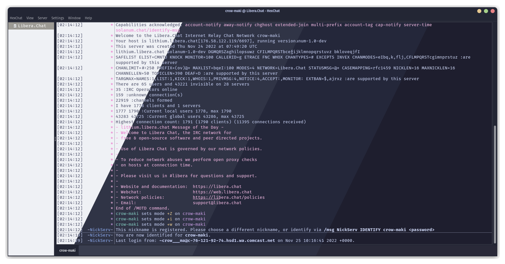
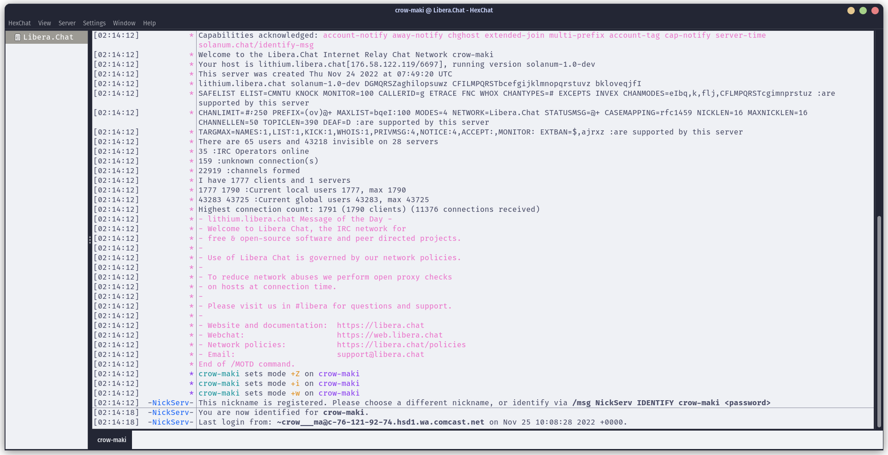
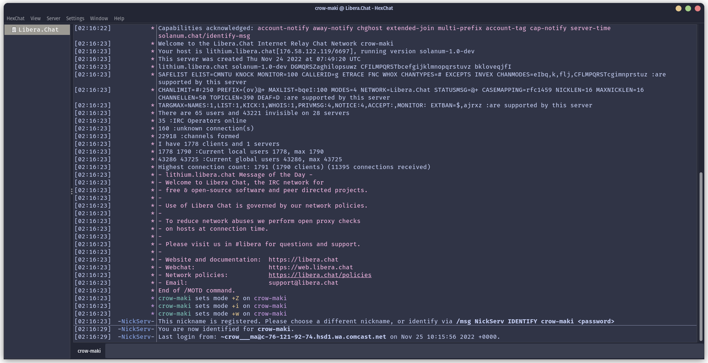
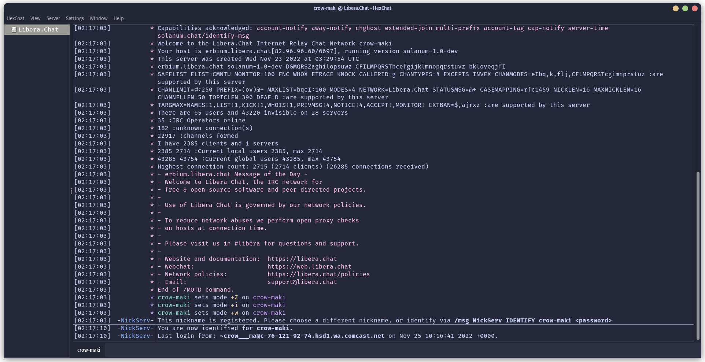
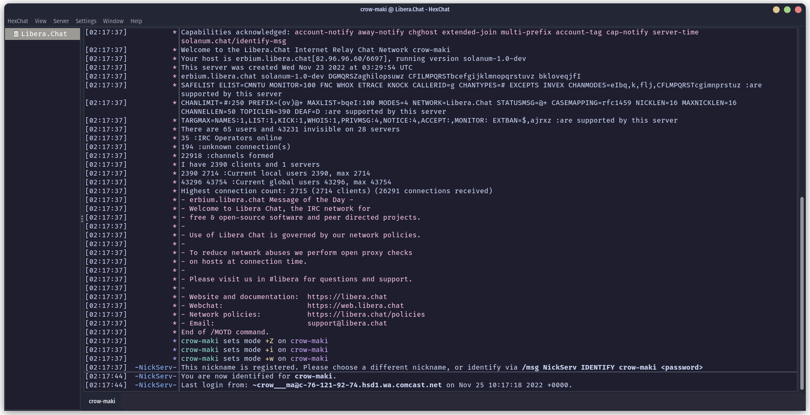

<h3 align="center">
	<br/>
	
	Catppuccin for <a href="https://hexchat.github.io/">HexChat</a>
	
</h3>

<p align="center">
	<a href="https://github.com/aszecsei/hexchat/stargazers"></a>
	<a href="https://github.com/aszecsei/hexchat/issues"></a>
	<a href="https://github.com/aszecsei/hexchat/contributors"></a>
</p>

<p align="center">
	
</p>

## Previews

<details>
<summary>🌻 Latte</summary>

</details>
<details>
<summary>🪴 Frappé</summary>

</details>
<details>
<summary>🌺 Macchiato</summary>

</details>
<details>
<summary>🌿 Mocha</summary>

</details>

## Usage

1. Clone this repository locally
2. Run the installation script while HexChat is closed:
```sh
./install 'latte' # or frappe, macchiato, mocha 
```
3. Launch HexChat

Alternatively, for manual installation:

2. Copy the desired `colors.conf` file to `$XDG_CONFIG_HOME/hexchat/` (usually this is `~/.config/hexchat`)
	- For example: `cp frappe/colors.conf ~/.config/hexchat/colors.conf`

## 🙋 FAQ
-   Q: **_"Why doesn't all of HexChat match the theme?"_**\
	A: HexChat themes only affect the panel backgrounds and text colors; to get the rest of the window to match you'll also need the [GTK](https://github.com/catppuccin/gtk) theme.
-	Q: **_"Why isn't this working with flatpak?"_**\
	A: Try copying the `colors.conf` file to `~/.var/app/io.github.Hexchat/config/hexchat/` instead.

## 💝 Thanks to

- [aszecsei](https://github.com/aszecsei)

&nbsp;

<p align="center">
	
</p>

<p align="center">
	Copyright &copy; 2021-present <a href="https://github.com/catppuccin" target="_blank">Catppuccin Org</a>
</p>

<p align="center">
	<a href="https://github.com/catppuccin/catppuccin/blob/main/LICENSE"></a>
</p>
